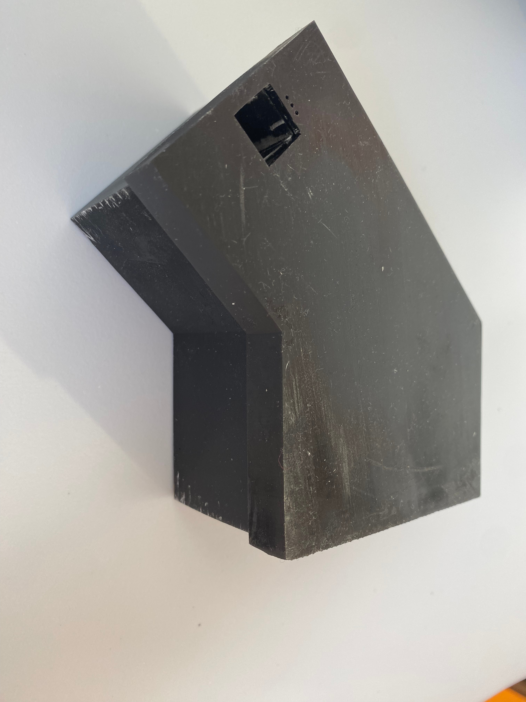

# Raspiscope Spectroscope CAD
I file *.FCStd sono realizzati con [FreeCAD Software](https://www.freecad.org/) per mantenere un'intera toolchain basata su software libero.

To download the software Raspiscope [click here](https://github.com/antlampas/raspiscope-python)

## Descrizione (IT)
Questa camera oscura è il complemento hardware del Raspiscope, lo spettrofotometro basato su Raspberry Pi 4 e sul software disponibile nel repository collegato qui sopra. Tutte le parti sono ottimizzate per la stampa 3D in resina, così da ottenere pareti opache e tolleranze strette lungo il percorso ottico.

### Componenti da integrare
- **Level shifter bidirezionale** per adattare i 3,3 V del GPIO del Raspberry Pi 4 ai 5 V richiesti da LED e sensore ad effetto Hall ([link Amazon](https://www.amazon.it/Gebildet-Converter-Bi-Directional-Shifter-CYT1076/dp/B07RY15XMJ/ref=sr_1_2_sspa?__mk_it_IT=%C3%85M%C3%85%C5%BD%C3%95%C3%91&sr=8-2-spons&sp_csd=d2lkZ2V0TmFtZT1zcF9hdGY)).
- **Convertitore DC-DC 12 V -> 5 V** se si alimentano LED e sensore con otto pile AA; in alternativa è possibile usare direttamente un alimentatore da 5 V dedicato. L'uscita a 5 V del Raspberry Pi può essere utilizzata, ma risulta spesso instabile ([link Amazon](https://www.amazon.it/JZK-Convertitore-ultraridotto-regolabile-alimentazione/dp/B08HK6Z91G/ref=pd_ybh_a_d_sccl_8/261-7476846-8643263?psc=1)).
- **Sensore ad effetto Hall SS49E** per rilevare la presenza della cuvetta ([link Amazon](https://www.amazon.it/EPLZON-Rilevatore-magnetico-riparazione-confezione/dp/B0C7TF2QN7/ref=sr_1_1_sspa?__mk_it_IT=%C3%85M%C3%85%C5%BD%C3%95%C3%91&sr=8-1-spons&sp_csd=d2lkZ2V0TmFtZT1zcF9hdGY&psc=1)).
- **Reticolo a diffrazione** per scomporre lo spettro luminoso ([link Amazon](https://www.amazon.it/educative-diffrazione-trasmissione-strumento-disponibili/dp/B0FS6TSNWJ/ref=sr_1_3?__mk_it_IT=%C3%85M%C3%85%C5%BD%C3%95%C3%91&sr=8-3))

### Licenza
Il progetto è distribuito come free software con licenza Creative Commons Attribution-ShareAlike 4.0 International (CC BY-SA 4.0).

## Description (EN)
This dark chamber is the hardware companion to Raspiscope, the Raspberry Pi 4-based spectrophotometer that runs the software linked above. Every part is tuned for resin 3D printing to keep the optical path opaque and dimensionally accurate.

### Additional components
- **Bidirectional level shifter** to translate the Raspberry Pi 4 GPIO 3.3 V logic to the 5 V required by the LED and the Hall effect sensor ([Amazon link](https://www.amazon.it/Gebildet-Converter-Bi-Directional-Shifter-CYT1076/dp/B07RY15XMJ/ref=sr_1_2_sspa?__mk_it_IT=%C3%85M%C3%85%C5%BD%C3%95%C3%91&sr=8-2-spons&sp_csd=d2lkZ2V0TmFtZT1zcF9hdGY)).
- **12 V -> 5 V DC-DC converter** when powering the LED and sensor with eight AA batteries; otherwise rely on a dedicated 5 V power supply. You can tap the Raspberry Pi’s 5 V rail, but it often proves unstable for this load ([Amazon link](https://www.amazon.it/JZK-Convertitore-ultraridotto-regolabile-alimentazione/dp/B08HK6Z91G/ref=pd_ybh_a_d_sccl_8/261-7476846-8643263?psc=1)).
- **SS49E Hall effect sensor** to monitor the presence of the cuvette ([Amazon link](https://www.amazon.it/EPLZON-Rilevatore-magnetico-riparazione-confezione/dp/B0C7TF2QN7/ref=sr_1_1_sspa?__mk_it_IT=%C3%85M%C3%85%C5%BD%C3%95%C3%91&sr=8-1-spons&sp_csd=d2lkZ2V0TmFtZT1zcF9hdGY&psc=1)).
- **Diffraction grating** to decompose the light spectrum ([link Amazon](https://www.amazon.it/educative-diffrazione-trasmissione-strumento-disponibili/dp/B0FS6TSNWJ/ref=sr_1_3?__mk_it_IT=%C3%85M%C3%85%C5%BD%C3%95%C3%91&sr=8-3))

### License
The project is released as free software under the Creative Commons Attribution-ShareAlike 4.0 International (CC BY-SA 4.0) license.

### Construction Schemes

### Images:

